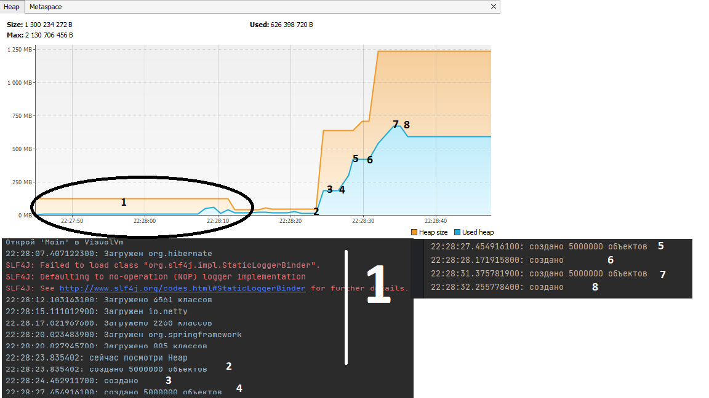
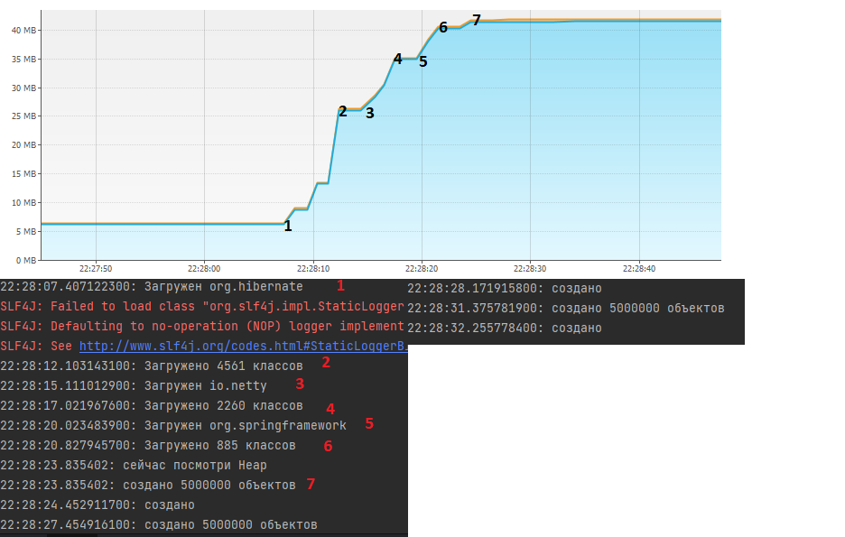

# Что происходит сначала?

После запуска метода main, начинается загрузка классов, используемых в методе loadToMetaspaceAllFrom.

# Heap

1. В *Heap* создаются объекты, которые используется в библиотеках, которые были заимпортированы через Maven;
2. На графике виден результат вызовов метода createSimpleObjects (2-3, 4-5, 6-7), который создает объекты
   SimpleObject и резервирует под них место в Heap.

**Голубая область** - это отражение на графике объема Heap, который используется кодом.

**Оранжевая область** - это отражения объема Heap, зарезервированный JVM.

Все понижения голубой области на графике являются результатом
работы GC (сборщика мусора), который удаляет объекты не имеющие ссылок, тем самым освобождая память.

# Metaspace

* Загрузка начинается после задержки (1), потому что загрузка классов "ленивая", т.е. происходит в момент, когда данные
классы используются. 

* После трех вызовов метода loadToMetaspaceAllFrom (1-2, 3-4, 5-6 на графике), вызывается метод
createSimpleObjects и загружаются классы для его выполнения (7). 

* Размер Metaspace составил ~40mb.